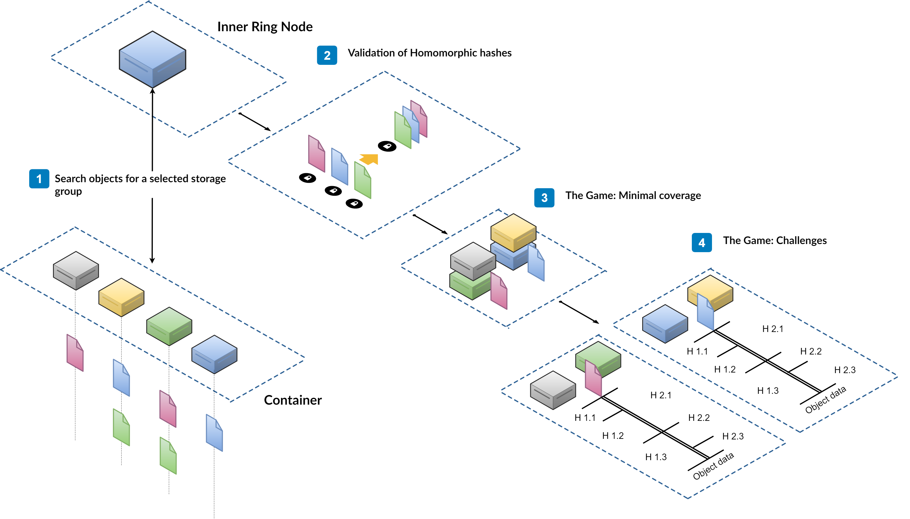

## Data Audit cycle

Data Audit cycle is triggered by the Epoch change. InnerRing nodes share the audit work between themselves and do as much audit sessions as they can. On the next round, if InnerRing nodes can't process everything, new nodes can be promoted from the candidate list. On the opposite, if the load is low enough, some InnerRing nodes can be demoted to maintain the balance.

## Data Audit Game

Each Epoch, Inner Ring nodes perform a data audit cycle. It is a two-stage game, in terms of the game theory. At the first stage, nodes serving the selected container are asked to collectively reconstruct a list of homomorphic hashes that form a composite hash stored in Storage Group. By doing that, nodes demonstrate that they have all necessary objects and are able to provide a hash of those objects. The provided list of hashes can be validated, but at the current stage, it's not known, if some nodes are lying.

At the second stage, it is necessary to make sure nodes are honest and do not fake check results. The Inner Ring nodes calculate a set of node pairs that store the same object and ask each node to provide thee homomorphic hashes of that object. Ranges are chosen in a way that the hash of a range asked from one node is the composite hash of ranges asked from another node in that pair. Nodes cannot predict objects or ranges that are chosen for the data audit session. They cannot even predict a pair node for the game. This stage discovers malicious nodes fast because each node is serving multiple containers and Storage Groups and participates in many data audit sessions in parallel during same Epoch. When a node is caught in a lie it get a reputation penalty and loses any rewards for the Epoch. So the price of faking checks and risks are too high and it is easier and cheaper for the node to be honest and behave correctly.

Combining the fact of nodes being able to reconstruct the Storage Group's composite hash and the fact of nodes honest behaviour, the system can consider that the data is safely stored, not corrupted, and available with a high probability.

In the case of a successful data audit result, the Inner Ring nodes initiate microtransactions between the accounts of the data owner and the owner of the storage node invoking the smart contract in the NeoFS N3 Sidechain.

### Audit tasks distribution

InnerRing nodes select containers to audit from a list of all containers in the network, forming a ring of containers, and taking an offset shackle with its number among InnerRing nodes and by audit number.

Each epoch, Inner Ring node performs data audit. One audit task is a one storage group to check. Storage groups from one container get merged into a single audit result structure that will be saved in the Audit smart contract in NeoFS Sidechain.

Upon each new Epoch notification, Inner Ring node must:

 1. Check amount of unfinished audit tasks from queue, log it and flush it \
    NeoFS uses these values to initiate Inner Ring list growth or shrink.
 2. Publish all unfinished audit results asynchronously \
    Audit results should be published on step 5 when all tasks for a single container are done. If a new epoch happens, Inner Ring node should wait for all active tasks to finish and then publish incomplete audit results.
 3. Choose new tasks to process \
    Inner Ring lists all available containers from the container contract. Additionally it can make extra invoke to find out container complexity, but for now consider all containers are the same. Then, based on index and epoch number, Inner Ring node chooses a slice of the containers to check. For each container it searches storage groups and put them in a task queue.
 4. Run these tasks in a separate fixed size routine pool \
    Audit checks run simultaneously in a separate pool of routines. This pool has fixed size, e.g. 3 tasks at a time. When a new epoch happens, inner ring uses a new pool of routines. Previous routine pool is alive until running tasks from the previous epoch are finished (we don't discard already started tasks). 
 5. Merge task results in audit result structures and publish them if there are no tasks left in the container
 6. Optionally dump task results to a file

### Data Audit session

For each selected container Inner Ring node will:

 - Generate a list of storage groups (object `SEARCH + GET`);
 - Check each group;
 - Record the results of all groups

The check of each group has three stages:

 - Prove-of-Retrievability (PoR);
 - Prove-of-Placement (PoP);
 - Prove-of-Data-Possession (PDP).

### Prove-of-Retrievability

During PoR check inner ring node should:

 1. Get storage group object
 2. For each member of a storage group, Inner Ring node makes `HEAD` request with `main_only` flag
 3. Compare cumulative object size and homomorphic hash with the values from step 1
 4. Depending on step 3, save storage group ID in a list of succeeded or failed checks in audit result

###  Prove-of-Placement

At this stage Inner Ring tries to create pair-coverage for all nodes in container. Later these pairs will play a game based on homomorphic hash properties (PDP check).

To do so Inner Ring:

 1. Picks random member X from the storage group
 2. Builds placement vector for X
 3. Makes `HEAD` request with `TTL=1 RAW=true main_only=true` to these nodes in placement order until there are enough responses or no more container nodes
 4. Increments `HIT` counter in audit result if responses from step 3 are without single failure
 5. Increments `MISS` counter in audit result if there are enough responses from step 3 but with intermediate failures
 6. Increments `FAIL` counter in audit result if there are not enough responses from step 3
 7. Gets pair of nodes that returned result in step 3 and mark them covered,
 8. Repeats everything from step 1, but ignore objects with placement in step 2 that does not increase coverage in step 7.

Here, enough responses means a number of copies according to container policy.

### Prove-of-Data-Possession

For all pairs after PoP, a Prove-of-Data-Possession is performed:

 - If a node from a pair loses the game, it gets into the “lucky” list,
 - If a node from a pair wins the game, it gets into the “unsuccessful” list.

### Hash check

For the hash check phase, the Inner Ring node gets the object information using `HEAD` request with the `short` flag toggled. Knowing the size of the object, the entire payload range is divided into four parts of a random length.

Next, hashes of ranges are requested. One request per range, with random delay, from both nodes.

Node A:
$$ hash_{A.1} = TZHash(Range(0, p2)), $$
$$ hash_{A.2} = TZHash(Range(p2, p3-p2)), $$
$$ hash_{A.3} = TZHash(Range(p3, length-p3)) $$

Node B:
$$ hash_{B.1} = TZHash(Range(0, p1)), $$
$$ hash_{B.2} = TZHash(Range(p1, p2-p1)), $$
$$ hash_{B.3} = TZHash(Range(p2, length-p2)) $$

If the hashes obtained successfully, then the check considered passed if:

$$ hash{A.1} = hash{B.1} + hash{B.2}, $$
$$ hash{B.3} = hash{A.2} + hash{A.3}, $$
$$ hash{A.1} + hash{A.2} + hash{A.3} = hash{B.1} + hash{B.2} + hash{B.3} =
object hash $$
